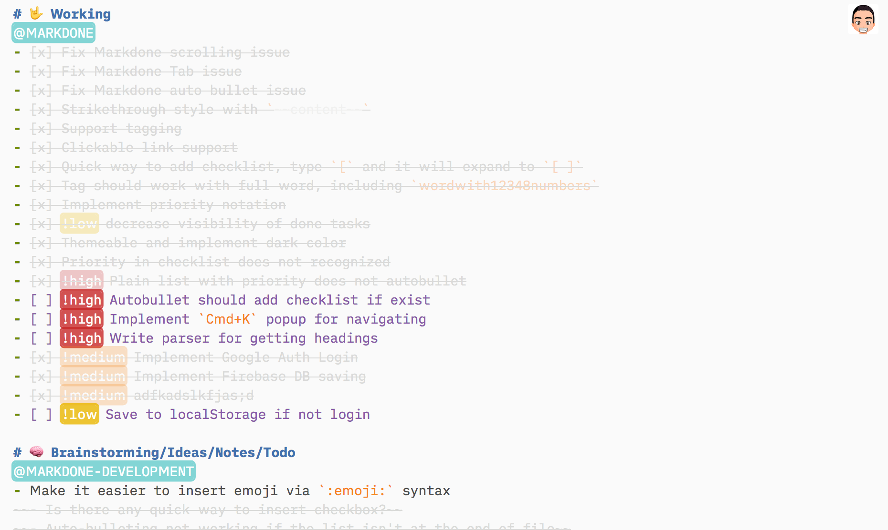

# A Markdown-based Notepad

Don't think, just use it: [https://markdone.now.sh](https://markdone.now.sh)



It's just a markdown editor, with no preview, lol.

## How to get started

Get the source code:

```
git clone https://github.com/huytd/markd.one
```

**Create the `secret.js` file, based on the template from `example.secret.js`, and fill in your Firebase configuration in it.**

```
mv example.secret.js secret.js
```

Install the dependencies:

```
yarn install
```

Run the dev server:

```
yarn dev
```

When you are ready to deploy:

```
yarn build
```

And your stuff are ready in `dist` folder, you can deploy it, for example, using `now.sh`.

## Contribution

Just commit, push and create [Pull Request](https://github.com/huytd/notepad/pulls) (if you want :P, but yes, please)

## License

Published under BSD 2 Clause License.

The project is using a self-hosted version of [iA Writer Duospace font](https://github.com/iaolo/iA-Fonts/tree/master/iA%20Writer%20Duospace).
